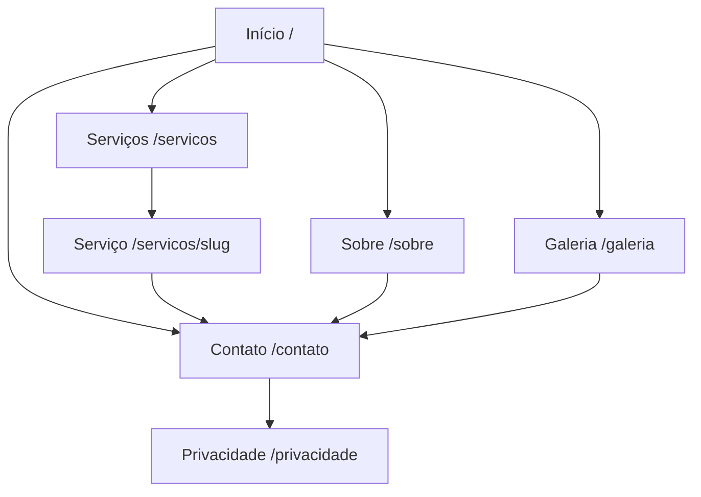

# Arquitetura-alvo — fábrica de sites NOX

**Status:** decisão aprovada para orientar as próximas fases.  
**Data de verificação:** 2026-08-25.  
**Escopo deste documento:** fronteiras, responsabilidades, segurança e sequência de entrega. Não autoriza integração com provedores nem alteração em produção.

## Decisão central

Cada cliente terá:

- um repositório GitHub privado, criado a partir do `nox-site-template`;
- um projeto Vercel isolado, ligado somente a esse repositório;
- versões identificadas pelo commit imutável;
- prévias por branch/pull request;
- publicação condicionada à aprovação humana de uma revisão exata;
- rollback para uma revisão que já tenha sido publicada com sucesso.

Essa é a modalidade **multi-project**. Ela prioriza isolamento, entrega do código ao cliente, evolução independente e rollback por site. O custo operacional maior é aceito conscientemente.

## Responsabilidades

| Parte | Responsabilidade |
| --- | --- |
| ChatGPT | Direção de produto, arquitetura, regras, contratos e revisão de decisões |
| Claude Code | Construção e evolução do NOX OS, do template, do site-kit e da infraestrutura |
| NOX OS | Fonte de verdade de dados, filas, custos, permissões, estados e aprovações |
| Cursor Cloud Agent | Alterar somente o repositório privado do site solicitado, em branch própria |
| GitHub | Repositórios, commits, pull requests, testes, proteção da branch e rollback de código |
| Vercel | Previews, produção, domínio, SSL e histórico de deployments |
| Usuário autorizado | Aprovar uma revisão específica antes da publicação |

Nenhum provedor externo decide estado de negócio. GitHub, Cursor e Vercel reportam fatos; o NOX OS valida esses fatos e executa a transição de estado.

## Estruturas obrigatórias

```text
nox-os
├── domínio, briefing, estados, permissões, fila, custos e aprovações
├── adaptadores GitHub, Cursor e Vercel
└── painel operacional

nox-site-template
├── aplicação Next.js completa e gerável
├── contrato de conteúdo factual
├── CI e regras de qualidade
└── referência exata de @nox/site-kit

@nox/site-kit
├── contratos e schemas sem dependência de UI
├── tokens de design e componentes acessíveis
├── SEO, JSON-LD, analytics e formulários reutilizáveis
└── versionamento semântico

site-<cliente>
├── cópia privada criada do template
├── somente dados destinados à publicação
├── customizações do Cursor em branch/PR
└── lockfile e manifesto de geração imutáveis
```

`nox-os`, `nox-site-template` e `@nox/site-kit` nunca entram no contexto de um Cloud Agent de cliente.

Na primeira versão, o template consome um tarball versionado do `@nox/site-kit`
armazenado em `vendor/`, com SHA-256 no manifesto. Assim, Cursor e Vercel não precisam
de credencial de registry, e builds antigos continuam reproduzíveis mesmo se um serviço de
pacotes estiver indisponível. O código-fonte e o versionamento do pacote continuam separados.

## Fluxo de ponta a ponta

```text
Briefing aprovado
    -> reserva de crédito e criação de job durável
    -> repositório privado criado do template
    -> projeto Vercel criado e ligado ao repositório
    -> manifesto factual commitado na main
    -> Cursor iniciado para esse repositório
    -> branch cursor/* + pull request
    -> GitHub Actions valida
    -> Vercel gera preview
    -> NOX OS reconcilia Cursor, GitHub e Vercel
    -> revisão com commit + preview fica disponível
    -> usuário autorizado aprova essa revisão exata
    -> NOX OS publica/promove o deployment dessa revisão
    -> domínio aponta para a produção aprovada
```

Se qualquer etapa posterior ao último deployment publicado falhar, o domínio continua servindo o último deployment publicado. Estado novo nunca substitui produção por antecipação.

## Estados e identidade imutável

Uma execução é identificada por `GenerationRun`. Uma saída revisável é identificada por `SiteRevision` e precisa conter no mínimo:

- `repositoryUrl`;
- `branchName`;
- `pullRequestUrl`;
- `commitSha` completo;
- `templateVersion` ou commit do template;
- versão exata do `@nox/site-kit`;
- `briefVersionId` e `factsHash`;
- SHA-256 do snapshot público de conteúdo;
- URL e id do preview Vercel;
- resultado consolidado dos checks obrigatórios.

Uma aprovação aponta para `SiteRevision.id`, nunca apenas para projeto, branch, PR ou URL. Se o commit mudar depois da aprovação, a aprovação fica inválida e uma nova revisão precisa ser aprovada.

Produção aponta para `Deployment.siteRevisionId`. Rollback cria um novo evento de deployment para uma revisão antiga; não reescreve o histórico.

## Fronteira de dados

O repositório do cliente recebe somente conteúdo que pode aparecer publicamente no site:

- nome e descrição confirmados;
- serviços confirmados;
- endereço, telefone, WhatsApp, mapa, horários e redes somente quando confirmados;
- imagens com origem, licença, crédito e texto alternativo;
- configuração pública de analytics e consentimento;
- páginas e metadados derivados desses fatos.

O repositório não recebe:

- acesso ao banco do NOX OS;
- cookies ou sessão do NOX OS;
- chaves principais de GitHub, Cursor, Anthropic ou Vercel;
- tokens de outros clientes;
- dados de prospecção que não serão publicados;
- payloads internos de auditoria, custos ou permissões.

Credenciais necessárias em produção são inseridas pelo NOX OS diretamente no projeto Vercel após a geração. Elas não são commitadas nem passadas ao Cursor.

## Segurança do Cursor

A integração deve usar a API v1 atrás de `CodeGenerationProvider`; nenhuma rota ou serviço de domínio depende diretamente do formato beta.

Configuração obrigatória de cada execução:

- exatamente um repositório em `repos`;
- `workOnCurrentBranch: false`;
- `autoCreatePR: true`;
- branch principal protegida e sem push direto;
- nenhum MCP server por padrão;
- nenhum segredo do NOX OS ou da Vercel;
- rede em modo allowlist-only, limitada ao necessário para GitHub e dependências;
- repositórios centrais adicionados à blocklist do Cursor quando o plano contratado oferecer esse controle;
- prompt contendo o manifesto factual e proibição explícita de inventar afirmações;
- merge sempre executado pelo fluxo controlado, nunca pelo agente.

A documentação atual informa que Cloud Agents executam comandos sem pedir aprovação, têm internet por padrão e encerram entregando uma branch/PR. Portanto, PR, checks, egress restrito e ausência de segredos são barreiras obrigatórias, não opcionais.

### Gate de isolamento antes de produção

Selecionar um único repositório na requisição limita o contexto solicitado, mas não prova sozinho que a identidade conectada não alcança outros repositórios autorizados no Cursor. O piloto precisa executar um teste negativo documentado:

1. iniciar agente no repositório A;
2. pedir explicitamente leitura do repositório B;
3. exigir que a tentativa falhe;
4. registrar evidência do bloqueio.

Se esse teste não passar, a integração não entra em produção até adotar uma identidade/instalação isolada por cliente, um controle empresarial equivalente ou worker self-hosted com credencial GitHub limitada a um repositório.

## Acompanhamento durável

A API Cursor v1 está em beta. Ela possui consulta de runs e stream SSE, mas webhooks v1 ainda são anunciados como futuros. A arquitetura não pode depender de conexão aberta ou de uma função web viva.

O NOX OS usará:

- outbox transacional para criar trabalho após o commit do banco;
- worker com lease, tentativas limitadas e backoff com jitter;
- idempotency key por ação externa;
- polling de `GET /v1/agents/{agentId}/runs/{runId}`;
- reconciliação periódica para jobs abandonados;
- estado terminal local somente após persistir o resultado externo;
- adaptador de eventos substituível para adotar webhook depois sem mudar o domínio.

O stream SSE pode alimentar atualização visual em tempo quase real, mas não é a fonte de verdade e não substitui polling/reconciliação.

## GitHub

O NOX OS deve autenticar com GitHub App, não com token pessoal. Tokens de instalação são curtos, gerados sob demanda e reduzidos ao repositório/permissões necessários.

Permissões mínimas esperadas do App, a confirmar endpoint por endpoint durante a implementação:

- repository metadata: read;
- contents: read/write;
- pull requests: read/write;
- checks/actions: read;
- administration: somente se for indispensável para criar repositório ou ruleset; separar o provisionador privilegiado do reconciliador cotidiano.

`main` exige pull request e checks de typecheck, lint, testes, build, links internos e validação do manifesto. O Cursor não recebe permissão para contornar rulesets.

## Vercel

Cada site terá projeto próprio, com builds, funções, variáveis e configurações isoladas. O token da equipe Vercel vive somente no NOX OS.

O NOX OS registra ids externos, URLs e estados; nunca registra o token. A publicação sempre usa o deployment associado ao commit aprovado. Domínio e SSL só são alterados depois de o projeto e o deployment terem sido verificados.

## Contrato do site completo

Arquitetura de informação padrão para negócio local:

```text
Início (/)
├── Sobre (/sobre)
├── Serviços (/servicos)
│   └── Serviço confirmado (/servicos/[slug])
├── Galeria (/galeria)
├── Contato (/contato)
├── Política de privacidade (/privacidade)
└── Página não encontrada (404)
```



Navegação principal: Início, Sobre, Serviços, Galeria e Contato; CTA de WhatsApp aparece somente quando houver número confirmado. Serviço individual fica a no máximo dois cliques da home. Breadcrumbs aparecem nas páginas internas e refletem a URL.

Regras de links internos:

- home liga para o hub de serviços e para serviços prioritários;
- hub liga para todos os serviços;
- serviço liga para serviços relacionados e contato;
- sobre e galeria ligam para contato;
- nenhuma página publicada pode ficar órfã.

### SEO e dados estruturados

- metadados únicos por página, canonical absoluto e Open Graph coerente;
- `sitemap.xml` e `robots.txt` derivados do conteúdo efetivamente publicado;
- JSON-LD server-side com `WebSite` e `Organization` na home;
- `LocalBusiness` ou subtipo somente quando os campos necessários forem confirmados;
- `Service` nas páginas de serviço;
- `BreadcrumbList` nas páginas internas;
- nunca gerar `AggregateRating`, `Review`, preço, horário ou oferta sem fato confirmado e conteúdo visível correspondente.

### Analytics e privacidade

Analytics nasce desligado. Quando configurado:

- carrega somente conforme a política de consentimento aplicável;
- não envia nome, telefone, e-mail, mensagem ou qualquer PII;
- usa eventos estáveis: `cta_clicked`, `whatsapp_clicked`, `phone_clicked`, `map_opened`, `contact_form_started` e `contact_form_submitted`;
- registra contexto em propriedades (`location`, `service_slug`, `form_type`), não no nome do evento;
- evita eventos duplicados em navegação client-side.

### Formulário

O formulário usa endpoint server-side do próprio site, validação estrita, honeypot, tempo mínimo de preenchimento, limite de tamanho, proteção durável contra abuso e adaptador de entrega. A credencial de entrega é exclusiva daquele projeto Vercel. O template não envia para serviço real enquanto o provisionamento seguro não estiver configurado.

## Custos e limites

Antes de qualquer operação cobrada:

1. estimar custo máximo;
2. verificar crédito disponível, teto mensal e limite por geração;
3. reservar saldo de forma atômica;
4. iniciar o provedor com idempotency key;
5. reconciliar custo real quando disponível;
6. liberar ou consumir a reserva;
7. acrescentar evento no `UsageLedger`.

Também são obrigatórios limite de concorrência por organização, timeout, cancelamento, número máximo de tentativas e circuit breaker por provedor. Falha de conciliação financeira bloqueia novas gerações pagas; nunca publica silenciosamente nem permite saldo negativo não autorizado.

Não se presume que `durationMs` do Cursor equivale a preço. Até a conta fornecer custo por run verificável, o sistema usa reserva conservadora e reconciliação administrativa.

## Roadmap aprovado

1. **Fase 2 — Contrato do site:** construir `@nox/site-kit`, `nox-site-template`, manifesto factual e CI, sem integrações externas.
2. **Fase 3 — Provisionamento:** GitHub App, repositório privado por site, projeto Vercel por site, preview manualmente reconciliada; ainda sem Cursor.
3. **Fase 4 — Orquestração:** fila durável, reserva de créditos, `CursorCodeGenerationProvider`, polling, PR e reconciliação de checks/previews.
4. **Fase 5 — Aprovação e publicação:** aprovação ligada ao commit, promoção para produção, domínio/SSL, rollback e auditoria operacional.
5. **Fase 6 — Endurecimento:** piloto de isolamento, testes de falha, observabilidade, limites, runbooks e ativação gradual.

Cada fase precisa estar verde e operável isoladamente antes da seguinte. A Fase 2 não cria repositórios de clientes, não chama Cursor, não cria projetos Vercel e não toca produção.

## Referências oficiais verificadas

- Cursor Cloud Agents API v1: https://cursor.com/docs/cloud-agent/api/endpoints
- Segurança dos Cloud Agents: https://cursor.com/docs/cloud-agent/security
- GitHub App e permissões mínimas: https://docs.github.com/en/apps/creating-github-apps/registering-a-github-app/choosing-permissions-for-a-github-app
- Tokens de instalação do GitHub App: https://docs.github.com/en/rest/apps/apps#create-an-installation-access-token-for-an-app
- Repositório a partir de template: https://docs.github.com/en/rest/repos/repos#create-a-repository-using-a-template
- Proteção e status checks: https://docs.github.com/en/repositories/configuring-branches-and-merges-in-your-repository/managing-protected-branches/about-protected-branches
- Vercel for Platforms, modo multi-project: https://vercel.com/changelog/introducing-vercel-for-platforms
- Autenticação e uso de credenciais Claude: https://code.claude.com/docs/en/legal-and-compliance
